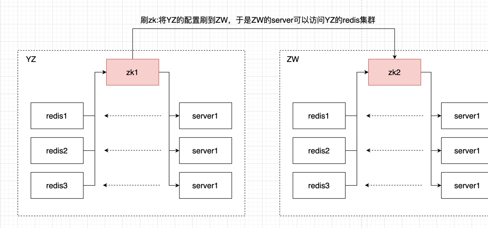

## A Simple Http Server

### Capabilities

- handle basic http get requests
- supports both blocking and non-blocking mode

### Architecture and Design

#### 1）Basic layout

The components can be listed from top-down as follows:
- HttpServer 

Responsible for the http protocol handling

- Command Parser

Parse commands received 

- Result Sender

Sends executing result to clients.

- Dispatcher

Dispatch connections connected to different workers

- Connector

Handling clients connection requests